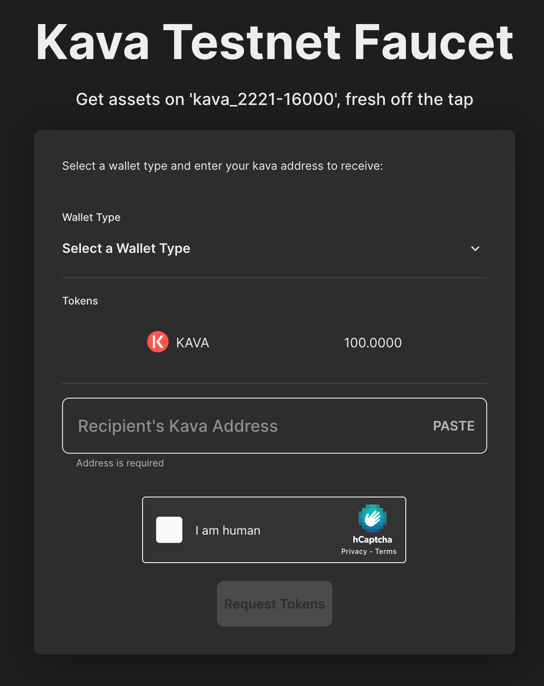

# Accessing the Kava Testnet Faucet

## Introduction

Welcome to the Kava Testnet Faucet! This tool allows developers and users to request Kava test tokens and USDC test tokens for testing and development purposes on the Kava blockchain. Our faucet is easy to use and supports both IBC and EVM addresses.

## How to Use the Kava Faucet

### Step 1: Navigate to the Faucet

Visit the Kava Faucet at [https://faucet.kava.io](https://faucet.kava.io).

### Step 2: Connect Your Wallet

Choose your preferred wallet from the options available. This will determine the tokens you will receive.

### Step 3: Enter wallet address

Enter your EVM or IBC address

### Step 4: Request Test Tokens

Once your wallet is connected, you can request test tokens. The faucet allows you to receive:

- 100 Kava test tokens
- 100 USDC test tokens (only for EVM wallets)

Select the tokens you need and click on the request button.

### Step 5: Confirmation

After requesting, the faucet will send the test tokens to your connected wallet. You should see a confirmation message on the faucet interface. Additionally, check your wallet to confirm the receipt of the tokens.

## Usage Guidelines

- The Kava faucet is intended for testing and development purposes only.
- Please respect fair usage policies and avoid excessive requests.
