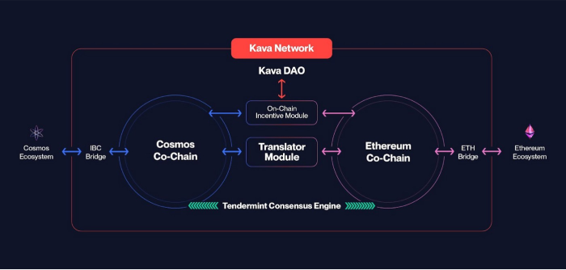

Learn how to build fast, scalable, and secure decentralized applications (dApps) on Kava. Kava EVM is a key component of the Kava Chain, which is an integral part of the Cosmos ecosystem. This platform is not only EVM compatible but also enhances its capabilities through the innovative use of the Cosmos SDK.

## Introduction to Kava EVM

Kava EVM stands out as a pivotal component within the Kava blockchain, uniquely blending Ethereum Virtual Machine (EVM) compatibility with the enriched features provided by the Cosmos SDK. This synthesis offers a potent environment for Ethereum developers, bringing together the familiarity of Ethereum's smart contract ecosystem with the advanced features of Cosmos.

## What is Kava EVM?

Serving as an EVM-compatible layer within the Kava blockchain, Kava EVM bridges Ethereum's established smart contract functionality with the innovative, scalable, and interoperable aspects of the Cosmos SDK. This strategic fusion allows Solidity developers to bring their Ethereum-based applications into the Kava network, benefiting from enhanced performance, security, and the broad advantages of the Cosmos ecosystem.

## KAVA Token

KAVA is the native gas token for both KAVA IBC and KAVA EVM. To learn more about how to acquire KAVA, visit [Get KAVA](https://app.kava.io/get-kava).

## Key Features of Kava EVM

- **Speed and Efficiency**: Featuring a 6-second block time and 1-block finality, Kava EVM ensures swift and efficient transaction processing.
- **Security and Scalability**: Powered by Kava's Tendermint consensus engine, the platform is secure and scalable, suitable for a wide range of applications and substantial transaction volumes.
- **Interoperability and Cosmos Ecosystem Integration**: As part of the Cosmos ecosystem, Kava EVM enjoys the interoperability offered by the Cosmos SDK, enabling easy interactions and asset transfers across diverse blockchain networks.

### Important Contract Addresses

1. **Tether USDt on Kava**

   - **Description**: Native issuance of Tether USDt on Kava EVM, facilitating the use of a prominent stablecoin within the ecosystem.
   - **Address**: [Tether USDt Contract on KavaScan](https://kavascan.com/token/0x919C1c267BC06a7039e03fcc2eF738525769109c/token-transfers)

2. **WKAVA (Wrapped KAVA)**
   - **Description**: WKAVA converts KAVA into an EVM-compatible format, similar to WETH on Ethereum, making it suitable for Ethereum-style smart contracts within Kava EVM.
   - **Address**: [WKAVA Contract on KavaScan](https://kavascan.com/token/0xc86c7C0eFbd6A49B35E8714C5f59D99De09A225b)

Kava EVM effectively combines the strengths of Ethereum with the unique advantages of the Cosmos SDK and the Kava network, creating a versatile and powerful platform for dApp development and deployment.
