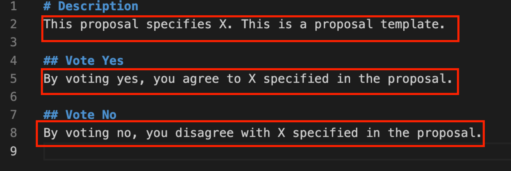
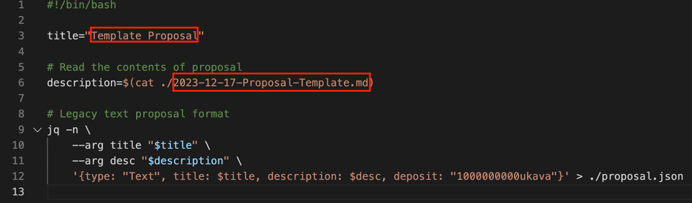

# Submitting a Text Proposal

This guide is for those who wish to submit a text governance proposal for the first time.

## Installing Kava application (we use this for the Kava CLI commands)

Instructions:

1. Search for your mac “terminal” program & open up and once you have this pulled up do the following steps.
2. Clone kava by running the command:

```sh
git clone git@github.com:Kava-Labs/kava.git
```

3. Checkout the latest version by running the command:

```sh
git checkout v0.24.0
```

4. Install by running the command:

```sh
make install
```

5. Run the command:

```sh
kava config node https://rpc.kava.io:443
```

6. Then run any kava command necessary.

## Submit the proposal using the kava commands in the directory with the file you want to submit

**Please note that you can use the proposal template found [here](https://github.com/Kava-Labs/kava-governance-public/tree/main/kava-15/gov/2023-12-17-Proposal-Template).**

1. Rename the “2023-12-17-Proposal-Template” folder to the folder name you desire for this proposal.
2. Rename the “2023-12-17-Proposal-Template.md” file to the name you desire for this proposal.
3. Edit the file contents of the “2023-12-17-Proposal-Template.md” file to reflect the description and details of your proposal. The following fields should be edited:  
   &nbsp;&nbsp;&nbsp;A. Description  
   &nbsp;&nbsp;&nbsp;B. Votes Yes  
   &nbsp;&nbsp;&nbsp;C. Vote No
   
4. Once the md file is edited to satisfaction:  
   &nbsp;&nbsp;&nbsp;A. Edit the “script.sh” to reflect the title you want for the proposal.  
   &nbsp;&nbsp;&nbsp;B. Edit the referenced md file to be the one you created in step 3.  
   
5. Run the script on the command line.
6. Verify that the proposal.json file is created correctly.
7. Submit the proposal from the directory in which you have the proposal.json file with the following command:

```sh
kava tx gov submit-legacy-proposal --proposal proposal.json --from user --gas auto --gas-adjustment 1.2 --gas-prices 0.01ukava --node https://rpc.kava.io:443 --chain-id kava_2222-10 --broadcast-mode sync
```

In the above command, replace ‘user’ with the name that you have assigned to your imported wallet (see the steps below if you don’t have a key already).

**Please note that you need at least 1,000 KAVA to have this proposal enter the voting period.**

## Troubleshooting

If you ever try to run a kava command and you are sure it is supposed to work, your kava version might be old.
Steps:

1. Check which version you have with command:

```sh
kava version
```

2. You can also check where you have your executable is located (if you’re curious, but that’s not where your github folder will be) by running command:

```sh
which kava
```

3. Go to the directory where you have the kava github folder installed (for me I’ve installed it in my documents/kava file structure).
4. Clone the new repo:

```sh
git clone https://github.com/Kava-Labs/kava.git
```

5. Checkout the new version:

```sh
git checkout v0.24.0
```

6. Install by running the command:

```sh
make install
```

## What kind of commands can I run? I’m new to this… I just installed kava onto my Mac terminal…

1. As a kava CLI user, I want to have my keplr wallet imported to the kava CLI (asks you to give your bip39 mnemonic phrase in order to import your keplr based wallet as the nickname user:

```sh
kava keys add user --recover
```

2. As a kava CLI user, I want to have my metmask wallet imported to the kava CLI (asks you to give your bip39 mnemonic phrase in order to import your eth-based wallet as the nickname user:

```sh
kava keys add --eth --recover user
```

3. As a kava CLI user, I want to see all of the addresses/wallets I’ve imported already:

```sh
kava -- keys list
```
