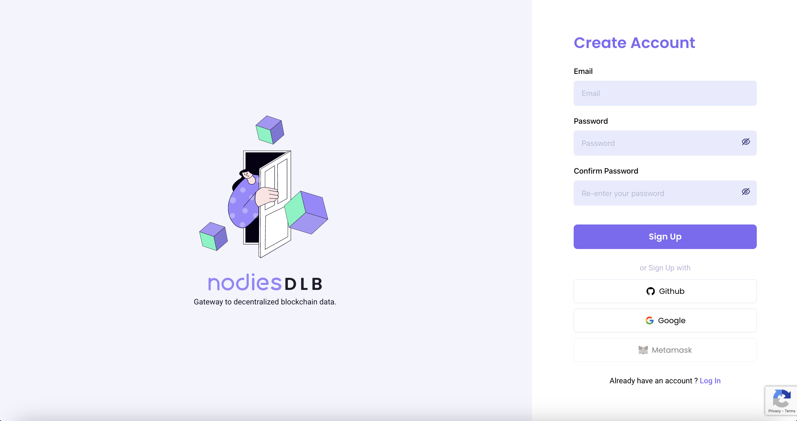
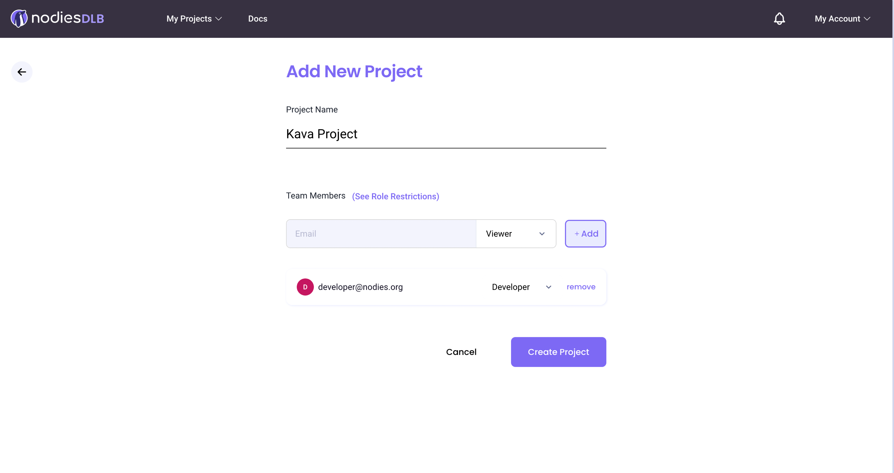
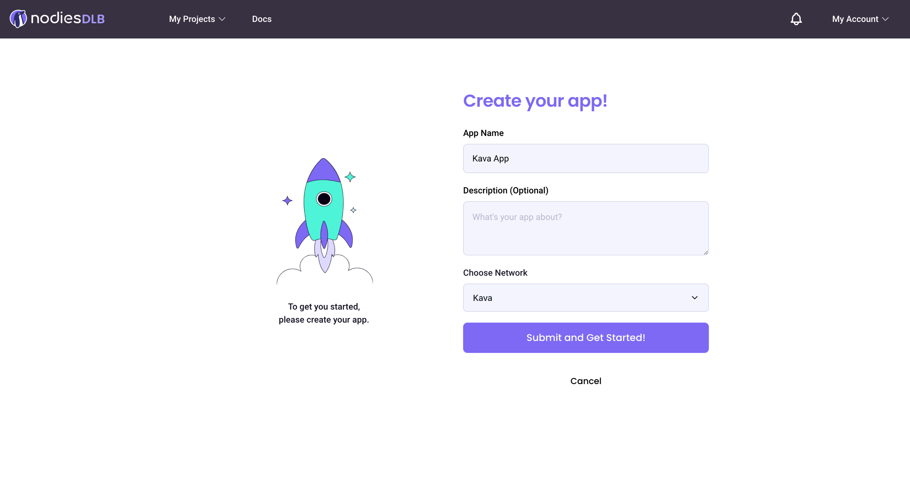
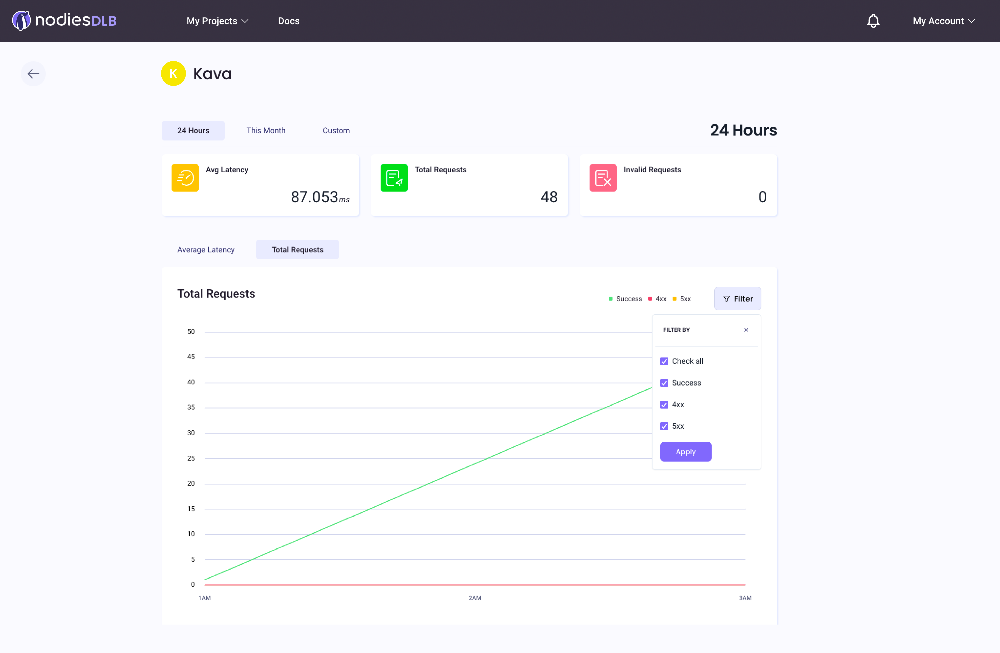

# Private Endpoints - Nodies

If you're building decentralized applications on KAVA's EVM, you'll need a dependable RPC service to access its full capabilities. This tutorial will show you how to set up your own private RPC endpoints using Nodies, a premium RPC provider.

## What is Nodies?

With a web3 journey dating back to 2021, Nodies prior experience in network infrastructure gives them the necessary expertise to provide a seamless RPC experience to dApps.

At the core of their offerings is a premium RPC service hosted on bare-metal infrastructure across multiple regions, ensuring the highest quality and reliability for your needs.

## What is an RPC endpoint?

An RPC (Remote Procedure Call) endpoint is a network address used by software applications to request and receive data from a remote server or service. In the context of blockchain, an RPC endpoint is used to access the blockchain data and execute transactions on the network.

## Benefits of a private endpoint

- **Avoid Rate Limiting:** Public endpoints provided by certain service providers may have rate limits or usage restrictions. Private endpoints typically offer more generous usage limits or may not have them at all, ensuring your application can function without interruptions.
- **Performance:** Private endpoints provide more consistent and predictable performance because they are not shared with a large number of users. This can be critical for applications that require low latency and high throughput.
- **Control:** With a private RPC endpoint, you have full control over who can access your endpoint. You can grant permissions on a per-user basis to ensure that only trusted parties can view or manage your endpoint.
- **Reliability:** By having your own endpoint, you can ensure that your
  application is not impacted by the performance or availability of shared
  endpoints. This means your application will have greater uptime and
  reliability.

## Projects and apps

- Your Nodies.app account is organized into Projects which can contain many Applications.
  - Team members can be assigned to Projects.
  - Team members can be assigned roles that define access to the Projects.
- An Application is tied to a network / private endpoint.
  - Statistics can be viewed on the application level.

## Usage Tiers

Nodies supports two payment tiers

- **Free:** Provides 15M relays per account per month, through any
  combination of private endpoints. Overages are charged at the Pay As You Go rate.
- **Pay As You Go:** After the free tier is used up, we charge a rate of $0.0000045 per request.
- **Enterprise:** Competitive pricing that starts at just $0.0000034 per request. For high request volumes, contact us @ [sales@nodies.org](sales@nodies.org) to explore further cost-effective options for your specific needs.

## Registration and Usage

**Step 1: Create an account at [https://Nodies.app](https://nodies.app).**

We provide multiple methods for registration to cater to various user preferences:

- **Email and Password:** You can register using your email address and a unique password.
- **Google Login:** Leverage your existing Google account to register quickly and conveniently.
- **Github Login:** Use your Github account credentials for easy registration.
- **Crypto Wallet Login:** This registration method is currently a work in progress (WIP) and will be available soon.



**Step 2: Create new Project**

Choose your first project name and add collaborators and assign roles to control access.



**Step 2: Create new Application**

Create an application tied to the project you just created. Customize the name and which network endpoint this application will utilize.

You can create more Applications for multi-chain Projects.

**If you want to use archive endpoints, please select "Kava Archival" as the network, if you want pruning endpoints please select "Kava" as the network**



**Step 3: Test your private Application endpoint**

You can test your private endpoint by making a HTTP request to it. Below are examples using cURL for EVM-based chains.

**MacOS/Linux:**

```
curl -X POST \\
-H "Content-Type: application/json" \\
--data '{"jsonrpc": "2.0", "id": 1, "method": "eth_blockNumber", "params": []}' \\
"https://lb.nodies.app/v1/{API_KEY}"
```

**Windows:**

```
curl -X POST ^
-H "Content-Type: application/json" ^
--data "{\"jsonrpc\": \"2.0\", \"id\": 1, \"method\": \"eth_blockNumber\", \"params\": []}" ^
"https://lb.nodies.app/v1/{API_KEY}"
```

**Step 4: View your Application statistics**

Select "My Projects" at the top of the screen and select your Project to see a dashboard of all the Applications your project contains.

You can view application statistics by clicking the bar graph icon.


