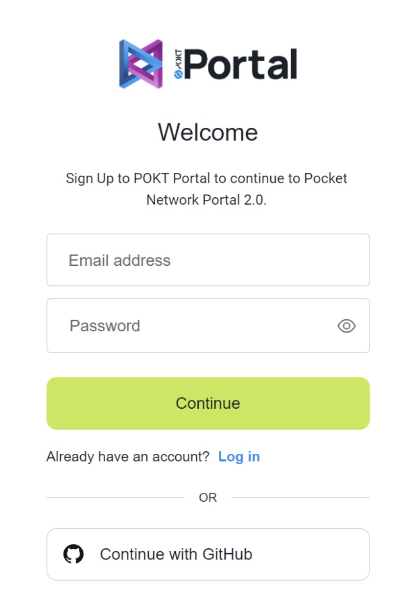
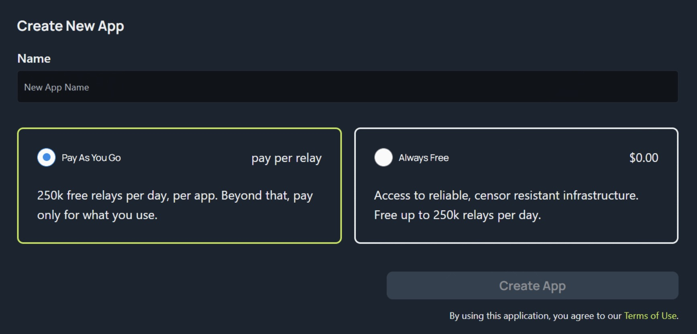
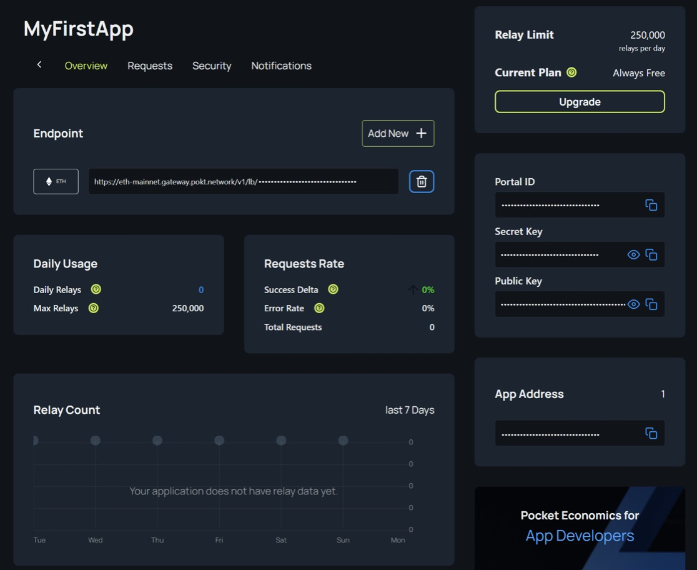
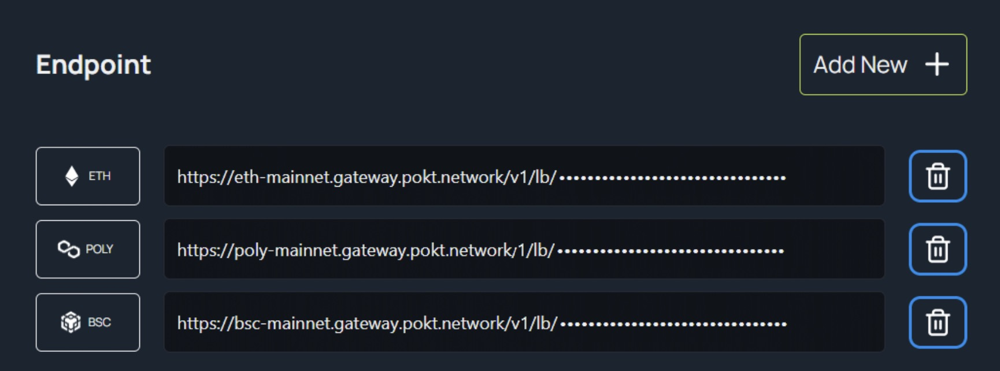

# Private Endpoints - Pocket Network

If you're building decentralized applications on KAVA's EVM, you'll need a dependable RPC service to access its full capabilities. This tutorial will show you how to set up your own private RPC endpoints using Pocket Network (POKT), a decentralized node provider for RPC services.

## What is an RPC endpoint?

An RPC (Remote Procedure Call) endpoint is a network address used by software applications to request and receive data from a remote server or service. In the context of blockchain, an RPC endpoint is used to access the blockchain data and execute transactions on the network.

## What is Pocket Network?

Pocket Network is the TCP/IP of Web3 node infrastructure – a multi-chain relay protocol that incentivizes RPC nodes to provide DApps and their users with unstoppable Web3 access. The decentralized nature of pocket network enables efficient scalability.

## Benefits of a private endpoint

- **Performance:** With your own endpoint, you have full control over the
  infrastructure and can optimize it for your specific use case. This can
  result in faster response times and better performance for your application.
- **Reliability:** By having your own endpoint, you can ensure that your
  application is not impacted by the performance or availability of shared
  endpoints. This means your application will have greater uptime and
  reliability.
- **Security:** Shared endpoints can be more vulnerable to attacks or data
  breaches, as there may be many applications accessing them. By having your
  own endpoint, you can implement security measures tailored to your
  application's needs, such as firewalls, monitoring, and access controls.

## Apps and Endpoints on Pocket Portal

- Your Portal account is organized into Applications (Apps), which are
  subdivided into Endpoints.
- An App is a project or container that allows you to view network throughput
  and relays across multiple blockchains.{' '}
- An Endpoint is the RPC URL that connects to a specific blockchain via
  Pocket’s network of decentralized nodes.{' '}
- Your account can contain a maximum of two Apps, and each App can contain any
  number of Endpoints for any number of chains.

## Usage Tiers

Pocket portal supports two payment tiers

- **Always Free:** Provides 250,000 relays per App per day, through any
  combination of Endpoints.
- **Pay As You Go: **Also provides the same 250,000 relays per App per day,
  through any combination of Endpoints. However, should your App request more
  than this in a day, you will be charged a per-relay usage fee.

## Integrating with Pocket Portal

**Step 1: Sign-up for Pocket network at https://www.portal.pokt.network/**

- Email address and GitHub login supported
- Verify your email address (or)
- Authorize login



**Step 2: Create new Application**

- Choose app name and tier
  
- The App Overview displays all the metrics associated with your App. The charts will start being populated as soon as you start submitting requests through an Endpoint associated with your App.
- **Endpoints:** List of Endpoints associated with the App
- **Portal ID:** Unique identifier for the App. This string is included as part of the URL for each Endpoint.
- **Secret Key:** Security feature for Apps. If “Private Secret Key Required” is selected in the Security section, the Secret Key will need to be sent along with the request using HTTP Basic Authentication.
- **Public Key: **Unique identifier for a given App that will allow you to
  inspect the App on-chain.
  

**Step 3: Create an Endpoint**

- Click on ‘Add new’ in the endpoint section
- Choose network from list ex., Kava Mainnet
- The new Endpoint will then appear in the list
- All Endpoints have a similar URL structure:
  ```
  https://<NETWORK>.gateway.pokt.network/v1/lb/<YOUR-PORTAL-ID>
  ```
  

**Step 4: Test your Endpoint**

Once you’ve set up your Apps and Endpoints to your liking, you can send requests to them to test that your settings are correct.
For EVM-based chains such as Ethereum, you can refer to the official [JSON-RPC](https://ethereum.org/en/developers/docs/apis/json-rpc/#json-rpc-methods) specification. Below is an example of such a request using cURL.

**MacOS/Linux:**

```
curl -X POST \\
-H "Content-Type: application/json" \\
--data '{"jsonrpc": "2.0", "id": 1, "method": "eth_blockNumber", "params": []}' \\
"https://<NETWORK>.gateway.pokt.network/v1/lb/<YOUR-PORTAL-ID>"

```

**Windows:**

```
curl -X POST ^
-H "Content-Type: application/json" ^
--data "{\"jsonrpc\": \"2.0\", \"id\": 1, \"method\": \"eth_blockNumber\", \"params\": []}" ^
"https://<NETWORK>.gateway.pokt.network/v1/lb/<YOUR-PORTAL-ID>"

```
